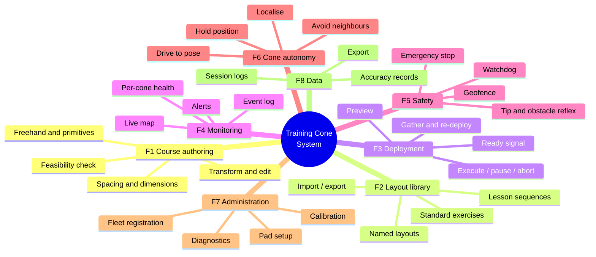

# 00 — Functional Specification

Collaborative Training Cone System · SLP 2026–2027
**This is the primary specification document.** It defines *what* the system does.
`01-architecture.md` defines *how*, and is subordinate to this document — if the two
conflict, this one wins and the architecture changes.

---

## 1. Purpose and scope

### 1.1 Problem statement

A driving instructor running a practical lesson on a training pad currently sets each
exercise by walking the pad and placing traffic cones by hand, measuring spacings with
paces or a tape. Changing from a slalom to a parallel-parking bay means walking the pad
again. In a 60-minute lesson this consumes 10–15 minutes of instruction time, produces
inconsistent geometry between sessions, and puts an instructor on foot in the same space
as a learner driver.

### 1.2 What the system does

The Collaborative Training Cone System replaces manual placement with a fleet of
self-driving cones. The instructor selects or draws an exercise on a tablet; the fleet
arranges itself into that exercise; redrawing rearranges it. Cone geometry becomes
repeatable to the centimetre, changeover takes under a minute, and the instructor never
leaves the vehicle or the pad edge.

### 1.3 System boundary

**Inside the boundary:** the cone units, the localisation infrastructure (anchors), the
radio gateway, the coordinator software, and the tablet application.

**Outside the boundary:** the training pad and its surface, the training vehicle, the
driving syllabus, mains power and charging infrastructure, and the instructor's tablet
hardware.

### 1.4 Actors

| Actor | Type | Interaction |
|---|---|---|
| **Instructor** | Primary human user | Authors and deploys layouts, monitors, stops. Assumed non-technical; assumed to be seated in or beside a vehicle |
| **Technician** | Secondary human user | First-time pad setup, calibration, charging, firmware updates, fault recovery. Assumed to be trained on the system |
| **Cone unit** | Autonomous agent | Localises, drives, avoids, reports, protects itself |
| **Coordinator** | Software agent | Compiles layouts, assigns and plans, mediates all instructor commands |
| **Trainee driver** | Affected party, **not a user** | Never operates the system. Their safety constrains every requirement in §6 |

### 1.5 Operating environment (assumed)

Outdoor asphalt or concrete training pad, nominally 30 × 50 m, effectively flat
(gradient ≤ 5%), daylight, dry to lightly wet, 0–45 °C. One training vehicle on the pad
at a time. No overhead cover. This environment drives many requirements below and should
be confirmed with the advisor before the design freeze.

---

## 2. Feature catalogue

Features are grouped into eight functional areas. Each has an ID used throughout the
rest of the project — commit messages, test cases, report sections and the defence
presentation should all cite these IDs.

### F1 — Course authoring

The instructor defines the exercise geometry on the tablet.

| ID | Feature | Description |
|---|---|---|
| F1.1 | Freehand path | Draw a continuous path with a finger or stylus on a scaled plan of the pad |
| F1.2 | Point placement | Tap to place, drag to move, long-press to delete an individual cone position |
| F1.3 | Geometric primitives | Insert a parameterised straight line, arc, circle, or rectangle rather than drawing by hand |
| F1.4 | Path editing | Insert, move and delete control points; unlimited undo and redo |
| F1.5 | Automatic spacing | Distribute cones evenly along a path at a spacing set in metres (default 2.0 m, range 0.5–20 m), settable per segment |
| F1.6 | Numeric dimensioning | Enter exact dimensions instead of drawing — e.g. a 6.0 × 2.5 m parking bay, or a slalom at 9.0 m pitch |
| F1.7 | Feasibility check | Continuously validate the layout while it is being drawn: cones required vs cones available and healthy, every point inside the pad boundary, no two points closer than the minimum separation. Report violations in place, before deployment is offered |
| F1.8 | Layout transform | Translate, rotate and scale the whole layout on the pad; mirror about an axis |
| F1.9 | Reference overlay | Show pad boundary, a metric grid, and optionally the previous layout in grey for comparison |

**F1.7 is the feature that prevents the most common failure mode.** Without it an
instructor discovers mid-deployment that the layout needs nine cones and the fleet has
six healthy ones. Validation belongs at authoring time, not at execution time.

### F2 — Layout library

| ID | Feature | Description |
|---|---|---|
| F2.1 | Save | Store the current layout under a name, with the author and date |
| F2.2 | Load | Recall a stored layout into the editor or deploy it directly |
| F2.3 | Standard exercise presets | Ship a built-in, parameterised set (see §3) so a new instructor is productive without drawing anything |
| F2.4 | Manage | Duplicate, rename, delete; mark favourites |
| F2.5 | Import / export | Exchange layouts between instructors and installations as a documented JSON file |
| F2.6 | Lesson sequence | Group layouts into an ordered lesson; a single **Next Exercise** action advances the fleet from one to the next |

**F2.6 is the feature that best expresses the value of the whole project.** A single
button that reconfigures the entire pad between exercises is the demonstration that
makes the point to a panel far better than any single layout does.

### F3 — Deployment and execution

| ID | Feature | Description |
|---|---|---|
| F3.1 | Preview | Before any cone moves, show which cone is assigned to which target and the path each will take; report the estimated time to completion |
| F3.2 | Execute | Commit the layout; the fleet moves |
| F3.3 | Live progress | Per-cone state and remaining distance, an overall percentage, and an updating ETA |
| F3.4 | Pause / resume | Freeze the fleet in place and continue from the same assignment |
| F3.5 | Abort | Stop the operation. Offer stop-in-place or return-to-previous-layout |
| F3.6 | Ready signal | An unambiguous fleet-wide indication — on the tablet and on the cones — that every cone is within tolerance and settled, so the instructor knows the exercise may begin |
| F3.7 | Gather | Send every cone to a defined collection area for storage or charging |
| F3.8 | Re-deploy displaced cones | Detect a cone that has been knocked out of position and, on instructor confirmation, drive it back to its target without disturbing the rest of the layout |

**F3.6 is a safety-relevant feature, not a convenience.** The instructor must never have
to guess whether the fleet has finished moving before releasing a vehicle onto the pad.

**F3.8 is what makes the system usable in reality.** Cones in driver training get hit.
A system that requires a full redeployment after every contact is worse than manual
placement; a system that quietly nudges one cone back into place is better.

### F4 — Monitoring

| ID | Feature | Description |
|---|---|---|
| F4.1 | Live map | Real-time cone positions on the pad plan, with target positions shown as ghosts and deviation drawn as a vector |
| F4.2 | Per-cone status | Identifier, state, battery percentage, link quality, position error, time since last contact |
| F4.3 | Fleet summary | Count of cones ready / moving / faulted / offline, at a glance |
| F4.4 | Alerts | Raise and clear: low battery, link lost, cone tipped, cone blocked or stalled, localisation degraded, geofence violation |
| F4.5 | Event log | Timestamped record of every command, state change and alert for the session |

### F5 — Safety

Every requirement in this group is mandatory. None may be traded away for schedule.

| ID | Feature | Description |
|---|---|---|
| F5.1 | Emergency stop | A single action stops the entire fleet. Available as a permanent on-screen control **and** as a physical handheld button independent of the tablet |
| F5.2 | Communications watchdog | A cone that receives no valid command for 500 ms stops itself. Safety does not depend on the radio working |
| F5.3 | Geofence | A cone refuses to drive outside the configured pad boundary regardless of the commanded target |
| F5.4 | Tip-over detection | A cone that is knocked over cuts motor drive within 1 s and reports it |
| F5.5 | Obstacle reflex | A cone that detects an object within 40 cm ahead brakes, independently of the central planner |
| F5.6 | Vehicle-present interlock | While the instructor has flagged a vehicle as active on the pad, the fleet will not move. Overriding this requires a deliberate, separate confirmation |
| F5.7 | Speed limiting | Configurable maximum speed, enforced in firmware and defaulting to 0.8 m/s |
| F5.8 | Movement conspicuity | A moving cone shows a flashing light and sounds an intermittent tone |

**F5.6 does not appear in the proposal and should be added to it.** The system moves
robots across a surface on which a learner driver is operating a car. An explicit
interlock, owned by the instructor, is the single most important safety feature in the
specification.

### F6 — Cone autonomy

Functions each cone performs on its own.

| ID | Feature | Description |
|---|---|---|
| F6.1 | Self-localisation | Continuously estimate its own position and heading on the pad |
| F6.2 | Drive to pose | Navigate to a commanded position, and to a commanded heading where the exercise requires one |
| F6.3 | Hold position | Maintain position against wind, slope and minor contact; correct drift automatically |
| F6.4 | Mutual avoidance | Avoid other cones while in motion, cooperatively rather than by stopping |
| F6.5 | Telemetry | Report pose, state, battery and health at 10 Hz |
| F6.6 | Power-on self-test | Verify motors, encoders, IMU, radio and localisation at boot; refuse to join the fleet on failure |
| F6.7 | Battery management | Report state of charge; warn at 20%; refuse new assignments below 10%; return to the gather point while still able |
| F6.8 | Identify | On request, blink and beep so an operator can pick one physical cone out of the fleet |

**F6.8 costs almost nothing and will be used constantly.** The moment there are six
identical cones on a pad and cone 4 reports a fault, someone has to work out which one
cone 4 is.

### F7 — Administration

| ID | Feature | Description |
|---|---|---|
| F7.1 | Pad definition | Define the coordinate origin, the boundary polygon, the gather area, and the surveyed anchor positions |
| F7.2 | Fleet registration | Add, remove and rename cone units; assign identifiers |
| F7.3 | Calibration | Guided routines for wheel odometry scale, wheel track width, IMU bias, and anchor position refinement |
| F7.4 | Firmware update | Update every cone in the fleet from the coordinator, with version reporting |
| F7.5 | Diagnostics | Per-cone raw sensor view and manual jog control, for bring-up and fault finding |
| F7.6 | Defaults | Set default spacing, speed limits, position tolerance and geofence margin |

### F8 — Data

| ID | Feature | Description |
|---|---|---|
| F8.1 | Session record | Which layouts were deployed, when, and how long each changeover took |
| F8.2 | Accuracy record | Commanded versus achieved position for every deployment |
| F8.3 | Export | Emit session and accuracy data as CSV or JSON |

**F8.2 exists for the capstone report as much as for the product.** It is the mechanism
that produces the measured evidence for the acceptance criteria in §7 — build it early
and every test run afterwards generates report material automatically.

---

## 3. Standard exercise presets (F2.3)

These define the geometry the system must be able to produce, and therefore set the
minimum fleet size and the pad dimensions. Parameters are adjustable; the values given
are defaults.

| Preset | Geometry | Cones | Key parameters |
|---|---|---|---|
| **Slalom** | Single line of equally spaced cones | 5 | Pitch 9.0 m (range 5–15 m), entry offset |
| **Parallel parking** | Bay marked by 4 corner cones, optional 2 lead-in | 4–6 | Bay 6.0 × 2.5 m |
| **Reverse bay parking** | Two bay-defining lines | 6 | Bay 5.0 × 2.4 m, approach lane 4.0 m |
| **Three-point turn** | Two parallel kerb lines | 6 | Road width 6.0 m, length 12 m |
| **Emergency lane change** | Offset gates, ISO 3888-2 style | 8–12 | Gate widths by vehicle width, sections 12 / 13.5 / 11 / 12.5 / 12 m |
| **Circle / figure-of-eight** | One or two circles | 8–12 | Radius 8.0 m |
| **Garage / 90° park** | Three-sided bay | 5 | 5.0 × 2.5 m |

**Consequence for the fleet size, which the proposal leaves open:** the presets above
need 4–12 cones. A fleet of **6** covers the majority and is a defensible baseline for a
prototype; the architecture must not assume 6, and should be tested in simulation at 12.
Where a layout needs more cones than are available, F1.7 says so at authoring time and
offers to increase the spacing instead.

---

## 4. Use cases

### UC-1 — Set up an exercise before a lesson *(primary flow)*

**Actor:** Instructor **Precondition:** Fleet powered, localised, in the gather area

1. Instructor opens the tablet application; the live map shows six cones ready.
2. Instructor opens the layout library and selects **Slalom**.
3. Instructor adjusts the pitch from 9.0 m to 12.0 m; the preview updates live.
4. System validates: 5 cones needed, 6 available, all inside the boundary. **(F1.7)**
5. Instructor taps **Preview**; the system shows the assignment and the estimated
   time — 38 s. **(F3.1)**
6. Instructor confirms that no vehicle is on the pad and taps **Execute**. **(F3.2, F5.6)**
7. Cones move; the map shows live progress. **(F3.3)**
8. All cones settle within tolerance; the system shows **READY** and the cones stop
   flashing. **(F3.6)**
9. Instructor begins the lesson.

**Alternates:**
- *4a.* Fewer healthy cones than the layout needs → system offers to increase the
  spacing or to deploy a reduced version, and will not offer Execute until resolved.
- *7a.* A cone stalls → alert raised; the remaining cones complete; the instructor may
  retry that cone, exclude it, or abort.
- *6a.* Vehicle interlock is set → Execute is disabled with a visible reason.

### UC-2 — Change exercise mid-lesson

**Actor:** Instructor **Precondition:** A layout is deployed; a lesson is in progress

1. Instructor stops the vehicle clear of the pad and sets the vehicle interlock to
   *clear*.
2. Instructor taps **Next Exercise** in the active lesson sequence. **(F2.6)**
3. System computes the assignment from current positions to the new layout — cones
   already near a target keep it.
4. Instructor taps **Execute**; the fleet reconfigures in under 60 s. **(R3)**
5. **READY** appears; the lesson continues.

This use case is the project's headline demonstration. It should be the one performed
live at the defence.

### UC-3 — A cone is knocked over during an exercise

**Actor:** Cone, then Instructor

1. A vehicle contacts a cone; the cone tips.
2. The cone detects the tilt within 1 s, cuts motor drive, and reports `TIPPED`. **(F5.4)**
3. The tablet raises an alert identifying which cone, and shows it on the map. **(F4.4)**
4. Instructor pauses the lesson, rights the cone by hand.
5. The cone re-localises and reports `IDLE`.
6. Instructor taps **Re-deploy** and only that cone returns to its target. **(F3.8)**
7. **READY** returns.

**Design consequence:** the specification requires that righting a cone by hand is
sufficient to recover it. No tablet interaction, no power cycle, no re-pairing.

### UC-4 — A cone's battery runs out mid-session

1. Cone reaches 20% → warning alert, cone continues. **(F6.7)**
2. Cone reaches 10% → cone refuses further assignments, tells the coordinator, and
   requests recall.
3. The coordinator excludes it from future assignments and warns the instructor that the
   effective fleet is now five.
4. Instructor sends that cone to gather; F1.7 now validates layouts against five cones.

### UC-5 — End of day

1. Instructor taps **Gather**. **(F3.7)**
2. All cones drive to the collection area, arrange themselves in a row, and stop.
3. Technician switches them off and puts them on charge.

### UC-6 — First-time installation on a new pad

**Actor:** Technician

1. Mount four anchors on poles at the pad corners and survey their positions.
2. Enter the anchor coordinates, define the origin, trace the boundary and mark the
   gather area. **(F7.1)**
3. Register each cone unit. **(F7.2)**
4. Run the guided calibration routines. **(F7.3)**
5. Run the verification layout and confirm the achieved accuracy meets §7. **(F8.2)**

---

## 5. Tablet application — screens and features

Five screens. The instructor should never need more than two taps to reach an emergency
stop from anywhere in the application.

| Screen | Contains | Primary features |
|---|---|---|
| **Map** *(home)* | Scaled plan of the pad, live cone positions, fleet status strip, persistent E-STOP | F4.1, F4.2, F4.3, F5.1 |
| **Design** | Drawing canvas, tool palette, spacing and dimension inputs, live feasibility banner | F1.1–F1.9 |
| **Library** | Presets, saved layouts, lesson sequences | F2.1–F2.6 |
| **Deploy** | Assignment preview, ETA, Execute / Pause / Abort, vehicle interlock toggle, READY banner | F3.1–F3.8, F5.6 |
| **Fleet** | Per-cone detail, identify, alerts, event log, diagnostics entry | F4.4, F4.5, F6.8, F7.5 |

**Interaction constraints that follow from the operating environment:**

- Usable in direct sunlight — high contrast, large type, no thin light-grey text.
- Usable with gloves and with wet hands — touch targets ≥ 48 px, no hover states, no
  precision gestures.
- Usable one-handed while standing beside a vehicle.
- No destructive action without confirmation, except E-STOP, which must be instant.
- Fleet state must be readable in under two seconds from across the cabin — this is why
  READY is a full-width banner and not a small icon.

---

## 6. Non-functional requirements

| ID | Category | Requirement |
|---|---|---|
| NFR-1 | Accuracy | Achieved position within 15 cm RMS of commanded, 25 cm at the 95th percentile |
| NFR-2 | Accuracy | Achieved heading within 10°, where heading is specified |
| NFR-3 | Performance | Full reconfiguration of 6 cones over a 20 × 20 m area in ≤ 60 s |
| NFR-4 | Performance | Instructor command to first cone movement ≤ 500 ms |
| NFR-5 | Performance | Live map updates at ≥ 5 Hz |
| NFR-6 | Reliability | Command link packet loss < 2% at 50 m line of sight |
| NFR-7 | Reliability | Zero cone-to-cone collisions in 20 consecutive reconfigurations |
| NFR-8 | Endurance | ≥ 2 h of realistic session duty per charge |
| NFR-9 | Safety | Fleet halts within 500 ms of E-STOP or of loss of communications |
| NFR-10 | Environmental | Operates 0–45 °C, in daylight, on dry to lightly wet asphalt |
| NFR-11 | Environmental | Survives repeated vehicle contact at low speed and being driven over; no exposed rigid edges |
| NFR-12 | Environmental | Ingress protection to at least IP54 |
| NFR-13 | Usability | An instructor with no technical background can deploy a preset within 5 minutes of first use, unaided |
| NFR-14 | Scalability | Software imposes no fixed fleet limit; verified in simulation at 12 cones |
| NFR-15 | Maintainability | A cone unit can be opened and its battery replaced with hand tools in under 5 minutes |

NFR-11 deserves emphasis. The proposal asks for "a stable and durable mechanical
structure that protects the internal components while maintaining the appearance and
function of a training cone" — in practice that means the shell is sacrificial and
compliant, the electronics are isolated from shell deformation, and the centre of mass
is low enough that the unit tends to stay upright or to be easily righted.

---

## 7. Prioritisation and acceptance

### 7.1 MoSCoW

| Priority | Features |
|---|---|
| **Must** — without these there is no project | F1.1, F1.5, F1.7, F2.1, F2.2, F2.3, F3.1, F3.2, F3.3, F3.6, F4.1, F4.2, F5.1, F5.2, F5.3, F5.4, F5.7, F6.1–F6.6, F7.1, F7.2, F7.3 |
| **Should** — expected in a complete system | F1.2, F1.3, F1.4, F1.6, F1.8, F2.4, F3.4, F3.5, F3.7, F3.8, F4.3, F4.4, F4.5, F5.5, F5.6, F5.8, F6.7, F6.8, F7.5, F8.1, F8.2 |
| **Could** — if time permits | F1.9, F2.5, F2.6, F7.4, F7.6, F8.3 |
| **Won't** — this project cycle | See §8 |

F2.6 is listed as *Could* on grounds of effort, but it is the strongest demonstration
feature in the catalogue and is cheap once F2.2 and F3.2 exist. Promote it as soon as
the Must set is closed.

### 7.2 Minimum demonstrable product

The subset that must work live, on hardware, at the defence:

> **Four cones. The instructor loads the slalom preset, adjusts the spacing, previews,
> executes. The cones cross the area simultaneously without colliding and settle within
> tolerance. READY appears. The instructor loads a parking bay and executes again; the
> cones reconfigure. A cone is deliberately knocked over; the system detects it, alerts,
> and re-deploys it after it is righted. The instructor presses E-STOP mid-motion and
> everything halts.**

That single sequence exercises F1.5, F1.7, F2.3, F3.1, F3.2, F3.6, F3.8, F4.1, F4.4,
F5.1, F5.4 and F6.1–F6.4 — the whole Must set, in about four minutes. Build toward this
sequence specifically and rehearse it.

### 7.3 Verification matrix

Every requirement needs a stated method of proof. "It looked like it worked" is not one.

| Requirement | Method | Evidence produced |
|---|---|---|
| NFR-1, NFR-2 | 30 deployments measured against the overhead-camera ground-truth rig | Error scatter plot and CDF, from F8.2 logs |
| NFR-3 | 10 timed reconfigurations, worst case recorded | Timing table |
| NFR-4, NFR-5 | Instrumented timestamps end to end | Latency histogram |
| NFR-6 | Packet counters at 10, 25, 50 m | Loss vs distance chart |
| NFR-7 | 20 consecutive reconfigurations, video reviewed | Video plus event log |
| NFR-8 | Duty-cycle discharge test to the 10% cut-off | Discharge curve |
| NFR-9 | 20 E-STOP events and 20 induced comms failures, timed | Stop-latency table |
| NFR-13 | Two instructors unfamiliar with the system, timed, unaided | Observation notes |
| NFR-14 | Simulated fleet of 12 | Simulation run log |
| F5.3, F5.4, F5.5 | Deliberate provocation of each condition, 10 trials each | Pass/fail table |

---

## 8. Explicitly out of scope

Stating these protects the project from scope creep and pre-empts the panel's questions.

- **Autonomous obstacle mapping.** The pad is assumed open and known. Cones avoid each
  other, not arbitrary unmapped obstacles.
- **Vehicle detection or tracking.** The system does not sense the training vehicle. The
  vehicle interlock (F5.6) is set by the instructor, not inferred.
- **Operating while a vehicle is moving on the pad.** Cones move only between exercises.
- **Automatic charging or docking.** Gather (F3.7) brings cones to a collection point;
  a human connects the charger.
- **Night, heavy rain, snow or ice operation.**
- **Multiple simultaneous instructors or pads from one coordinator.**
- **Cones climbing kerbs, grass or gravel.**
- **Regulatory certification** of the cone as road furniture.

---

## 9. Open questions for the advisor

These change the specification and should be closed before the design freeze.

1. **Fleet size for the prototype.** §3 argues for six. Is the budget for six, or for
   fewer with the rest simulated?
2. **Pad dimensions and surface.** The 30 × 50 m asphalt assumption drives the choice of
   localisation technology. Is there a specific pad?
3. **Is indoor operation acceptable for the demonstration?** If yes, an overhead camera
   becomes viable as the primary localisation method and the highest-risk subsystem gets
   substantially cheaper and more accurate.
4. **Is heading control required, or is position enough?** Cones are rotationally
   symmetric, so heading matters only for asymmetric markers. If it is not required,
   NFR-2 and a meaningful amount of localisation work disappear.
5. **Does the deliverable need to survive being driven over, or only bumped?** NFR-11's
   severity is the single biggest driver of the mechanical design.
