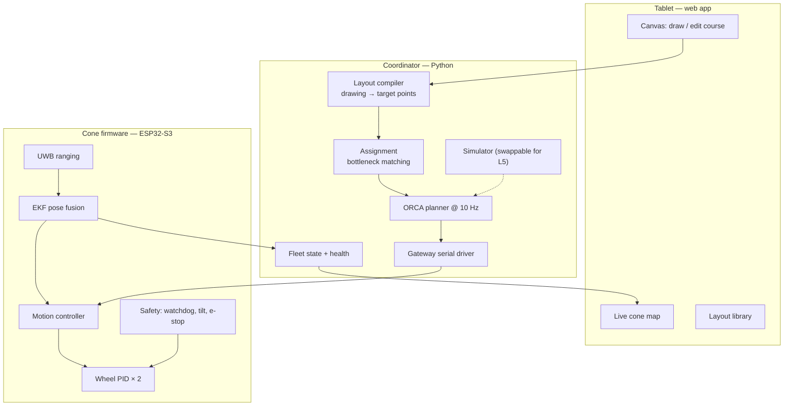
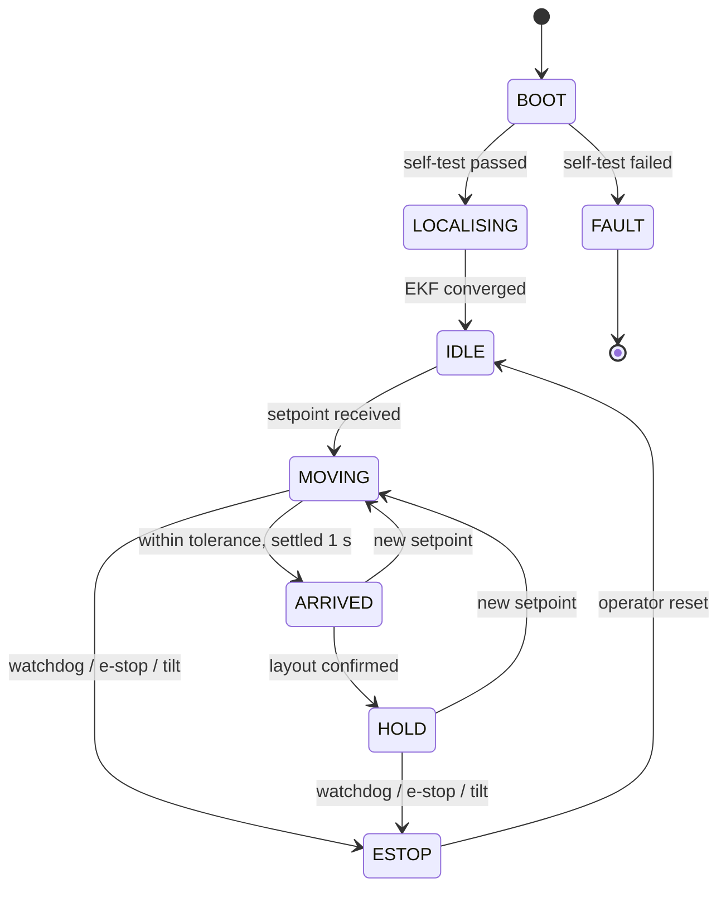

# 01 — System Architecture

## 1. What the system has to do

The proposal states the goal well but not measurably. Restated as engineering requirements:

| # | Requirement | Target |
|---|---|---|
| R1 | A cone reaches its commanded position | ≤ 15 cm RMS error, ≤ 25 cm at 95th percentile |
| R2 | A cone reaches its commanded heading (if commanded) | ≤ 10° |
| R3 | Full layout reconfiguration, 6 cones, 20 × 20 m pad | ≤ 60 s |
| R4 | Cone-to-cone collisions during reconfiguration | 0 in 20 consecutive runs |
| R5 | Command link | < 2% packet loss at 50 m, < 100 ms base→cone latency |
| R6 | Endurance | ≥ 2 h of a realistic training session per charge |
| R7 | Loss of comms | All cones stop within 500 ms |
| R8 | Cone knocked over by a vehicle | Detected < 1 s, motors cut, reported to instructor |
| R9 | Instructor workflow | Draw a course and execute it in < 30 s, no laptop needed |

R4, R7 and R8 are safety requirements. They come first: the system operates in the
same space as a student driver in a real car.

## 2. Four decisions that define the architecture

Everything else follows from these. Each is argued rather than asserted, because the
defence panel will ask "why not the other one?"

### 2.1 Where does the intelligence live? → **Hybrid, centre-of-mass at the coordinator**

| Option | Verdict |
|---|---|
| Fully centralised — coordinator computes wheel speeds, cones are radio-controlled motors | Simple, but every packet loss is a control-loop dropout, and it does not survive R7 gracefully |
| Fully decentralised — each cone runs local swarm rules (potential fields, boids) | Sounds impressive, but position assignment becomes emergent and unrepeatable. A driving course is a *specified* layout, not an emergent one |
| **Hybrid** — coordinator does assignment + global avoidance; cone does pose control + reflexes | **Chosen** |

The coordinator owns everything global (who goes where, whose path yields to whose).
Each cone owns everything local and fast (wheel PID, goal seeking, e-stop, tip
detection, comms watchdog). If the coordinator dies, cones coast to a stop on their own
watchdog — the safety property does not depend on the radio working.

This split also maps cleanly onto the team: one student can own the coordinator without
touching firmware, and vice versa.

### 2.2 How does a cone know where it is? → **UWB + odometry + IMU, fused**

This is the highest-risk subsystem in the project. If localisation is bad, nothing else
matters, so it deserves the most analysis.

| Method | Accuracy | Per-cone cost | Works outdoors | Gives heading | Area |
|---|---|---|---|---|---|
| Wheel odometry + IMU alone | drifts without bound | ~$10 | yes | yes (drifts) | ∞ |
| Overhead camera + ArUco markers | 1–3 cm | ~$0 (one camera) | poorly — sun, shadows | **yes, directly** | ~12 × 9 m per camera |
| **UWB trilateration (DW3000)** | **10–30 cm** | **~$20** | **yes** | no | **~100 m** |
| RTK-GPS (u-blox ZED-F9P) | 2 cm | ~$250 | yes (needs sky) | no | ∞ |
| Ultrasonic / IR beacons | 10–50 cm, noisy | ~$15 | marginal | no | ~10 m |

A driver-training pad is 30 × 50 m of open asphalt in daylight. That immediately kills
the overhead camera as the *deployed* solution and makes RTK-GPS unaffordable at 6+
cones. UWB is the only option that is both outdoor-capable and cheap enough to put on
every cone.

**Chosen: a DW3000-class UWB tag on each cone, trilaterated against four surveyed
anchors, fused with wheel odometry and a gyro in an Extended Kalman Filter.**

Three consequences the team must plan around:

1. **UWB gives position, not heading.** Recover heading from the gyro, corrected by the
   direction of travel — a differential-drive robot moving forward is, by construction,
   pointing where it is going. Correct the gyro bias whenever speed > 0.3 m/s. A second
   tag 25 cm from the first would give heading directly and is the fallback if this
   proves unstable; it doubles tag cost, so treat it as a contingency, not the baseline.
2. **Update rate falls as cones are added.** With two-way ranging, one fix costs about
   3 ms per anchor, so ~12 ms for four anchors. Under TDMA that is ~13 Hz at 6 cones and
   ~8 Hz at 10. Acceptable for the target fleet; if the fleet grows, migrate to TDoA
   (tags transmit, synchronised anchors listen), which scales to 100+ tags. Note this in
   the report as the scaling path — it is exactly the kind of forward-looking analysis
   that earns marks.
3. **Cones are low.** A cone is ~50 cm tall, so its tag sits near the ground where
   multipath off asphalt is worst. Mount anchors on 3–4 m poles, and never place all
   four anchors near-collinear — poor geometry (high GDOP) wrecks trilateration even
   with perfect ranges.

**Use the overhead camera anyway — as ground truth, not as the product.** During
development, an indoor rig with a 1080p camera at 6 m and an ArUco tag on each cone lid
gives ~1 cm absolute pose. That is the reference you measure the UWB+EKF stack *against*
to produce R1's error numbers. Building a validation rig, rather than eyeballing a tape
measure, is what separates a good capstone from an average one.

### 2.3 How do cones talk? → **ESP-NOW for control, Wi-Fi for the tablet, bridged by a gateway**

| Option | Latency | Range | Payload | Note |
|---|---|---|---|---|
| **ESP-NOW** | 2–5 ms | 200 m LOS | 250 B | Connectionless, no AP, native broadcast |
| Wi-Fi UDP via an AP | 10–50 ms, jittery | ~50 m | large | Needs infrastructure on an asphalt pad |
| BLE | 20–100 ms | 30 m | small | Connection-oriented, poor for 1-to-many |
| LoRa | 100–1000 ms | km | tiny | Far too slow for a 10 Hz control loop |

ESP-NOW wins the control link outright. But the tablet needs ordinary Wi-Fi, and an
ESP32 cannot sit on a Wi-Fi channel of the AP's choosing while also running ESP-NOW on a
different one — **ESP-NOW and Wi-Fi STA must share a radio channel.** Fighting that
constraint in firmware is a classic time sink.

**Chosen: don't fight it. Separate the radios physically.**

```mermaid
flowchart LR
    T["Instructor tablet<br/>(browser)"] -- "WebSocket / JSON<br/>Wi-Fi" --> C["Coordinator<br/>laptop or Raspberry Pi"]
    C -- "USB serial<br/>115200–921600 baud" --> G["ESP32 gateway"]
    G -. "ESP-NOW · 2.4 GHz · ch 1" .-> K1["Cone 1"]
    G -. "" .-> K2["Cone 2"]
    G -. "" .-> KN["Cone N"]
    K1 -. telemetry .-> G
    K2 -. "" .-> G
    KN -. "" .-> G
    A["4 × UWB anchors<br/>on 3–4 m poles"] -. ranging .-> K1
    A -. "" .-> K2
    A -. "" .-> KN
```

The gateway is a bare ESP32 doing one job: serial frames in, ESP-NOW out, and back. It
owns the ESP-NOW channel exclusively. The coordinator host handles Wi-Fi for the tablet.
Each half is independently testable, which matters when two different students own them.

### 2.4 How do cones avoid each other? → **Central ORCA at 10 Hz, local reflex on the cone**

Six cones crossing a 20 m pad simultaneously is a genuine multi-robot motion planning
problem, not a detail.

| Approach | Assessment |
|---|---|
| Artificial potential fields | Easy to write, but has local minima and oscillates in narrow passes. Not defensible |
| Prioritised / sequenced planning — one cone moves at a time | Trivially safe, but 6 cones × 20 m serially blows R3's 60 s budget |
| Time-space reservation (grid + time windows) | Sound, but discretisation is coarse and replanning on disturbance is expensive |
| **ORCA / reciprocal velocity obstacles** | **Chosen.** Continuous, runs at kHz for 6 agents, provably collision-free under its assumptions, and is the standard citation in the literature |

ORCA assumes holonomic agents. Differential-drive cones are not holonomic, so wrap the
ORCA output velocity with a unicycle controller that converts a desired (vx, vy) into
(v, ω) with a bounded turn rate — the standard "ORCA-DD" treatment, where the effective
agent radius is inflated to cover the turning transient.

**Size the safety radius from the real latency budget, not a guess:**

```
UWB fix interval            ~80 ms
coordinator planning cycle  100 ms
ESP-NOW + firmware          ~10 ms
----------------------------------
worst-case staleness       ~190 ms
```

At 0.8 m/s that is 15 cm of travel the planner cannot see. So:

```
r_safety = r_cone (0.20) + v·t_stale (0.15) + margin (0.20) ≈ 0.55 m
```

Round to **0.6 m**, cap coordinated speed at **0.8 m/s**, and drop to **0.3 m/s** inside
1 m of the goal. Independently, each cone runs a reflex layer: if a forward ToF sensor
reads < 40 cm, brake regardless of what the coordinator says. ORCA is the plan; the
reflex is the seatbelt.

## 3. Software decomposition



### 3.1 Coordinator responsibilities

| Module | Input | Output | Algorithm |
|---|---|---|---|
| Layout compiler | Polyline / spline from the tablet, in pad coordinates | Ordered list of target points | Arc-length resampling at a configurable spacing (default 2.0 m); reject if points needed > cones available |
| Assignment | N cone poses, M ≤ N targets | Cone → target mapping | **Bottleneck** (min-max) assignment, not min-sum |
| Planner | Assignment + live poses | Per-cone velocity command @ 10 Hz | ORCA with the radius above; goal-seek when no neighbour is in range |
| Fleet state | Telemetry stream | Health view, staleness flags | Per-cone sequence numbers, last-heard timestamps |

**Why bottleneck assignment and not the usual sum-of-distances Hungarian?** The layout
is not ready until the *last* cone arrives. Minimising the total distance travelled can
leave one cone with a long haul while five sit idle. Minimising the *maximum* single
distance is what actually minimises reconfiguration time — R3. Solve it by binary
search over the distance threshold with a bipartite feasibility check, or with the
standard threshold-Hungarian variant. Implement min-sum first (it is one library call),
measure it, then show the bottleneck version beating it on R3. That comparison is a
report figure on its own.

### 3.2 Cone firmware — the state machine



Every transition into `ESTOP` cuts motor drive in hardware, not just in software. The
watchdog is the important one: **no valid command for 500 ms → ESTOP**, which is how R7
is satisfied without the coordinator having to be reachable.

### 3.3 Control cascade on the cone

Three nested loops, each at its own rate:

| Loop | Rate | In | Out |
|---|---|---|---|
| Wheel velocity PID (× 2) | 200 Hz | Encoder counts (ESP32 PCNT hardware counters) | PWM duty |
| Unicycle pose controller | 50 Hz | EKF pose, target pose | v, ω |
| Command / avoidance | 10 Hz | ESP-NOW setpoint | Target pose or velocity |

Use the ESP32's **PCNT peripheral** for quadrature decoding, not pin interrupts — at
1.0 m/s with a 12 CPR encoder on a 30:1 gearbox you are looking at ~4 kHz of edges per
wheel, and interrupt-driven counting will start stealing cycles from the control loop.

Asphalt needs friction compensation: add a static feed-forward term to the PID output
so the wheel starts turning at low commands instead of stalling in the deadband.

## 4. Recommended stack

You had no preference, so here is a recommendation with the reasoning attached. Any of
it can be swapped — the architecture above does not depend on the languages.

| Layer | Choice | Why |
|---|---|---|
| Coordinator | **Python 3.11+** — numpy, `scipy.optimize.linear_sum_assignment`, asyncio, websockets | Assignment and ORCA are library calls or ~200 lines. Plotting for the report is free. Fast to iterate |
| Cone firmware | **C++ on ESP32-S3**, Arduino core or ESP-IDF | Dual core (radio on one, control on the other), hardware PCNT and MCPWM, huge community support for DW3000 and IMU drivers |
| Tablet UI | **Web app** — React + HTML Canvas, served by the coordinator | Runs on any tablet with a browser. No app store, no Android/iOS split, and the instructor connects to a Wi-Fi hotspot and opens a URL |
| Simulator | Python, sharing the coordinator's planner code verbatim | See §5 |

**On ROS 2:** it is the more academically impressive answer and it gives you Nav2, tf2,
rviz and Gazebo for free. It is not recommended here for two reasons: the learning curve
consumes a large fraction of a two-semester budget for a team that has not used it, and
none of the heavy machinery it provides (SLAM, costmaps, sensor pipelines) is needed on
a flat, empty, well-instrumented pad. If any student already knows ROS 2 well, revisit
this — the decision flips entirely on that one fact.

## 5. Build the simulator first

This is the most important process recommendation in this document.

Write the coordinator against a **cone interface**, then provide two implementations of
it: a serial gateway and a simulator that integrates differential-drive kinematics with
injected noise (UWB jitter, wheel slip, packet loss, latency). The planner cannot tell
them apart.

What this buys:

- The three software-heavy roles are never blocked on the machine shop.
- Assignment, ORCA and the layout compiler are debugged with 20 cones on a laptop, then
  demonstrated on 6 real ones.
- Every failure you can only cause on purpose — 30% packet loss, a cone that stops
  responding, an anchor going down — becomes a repeatable test.
- The simulator is a demonstrable deliverable in its own right if hardware slips.

Then integrate in this order, and not out of it: **1 cone → 2 cones (this is where
collision avoidance first becomes real) → 6 cones**. Order the parts for six but build
and prove two.
